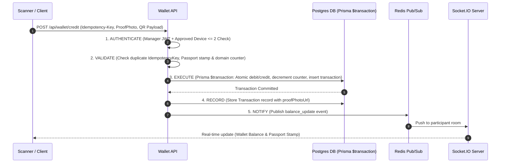

# Carnival Reserve — Implementation Plan

"Carnival Reserve" is a high-concurrency currency-tracking web application designed for a one-day college festival carnival (supporting up to ~1,200 concurrent participants). It features an isolated 17-domain treasury system, marketplace inventory management, end-of-day auctions, real-time balance updates, offline volunteer scanning, and a Neo-Brutalist design language.

## Architecture & Monorepo Overview

The project is structured as a Turborepo/npm workspace monorepo:

```
carnival-reserve/
├── apps/
│   ├── web/                 # Participant Web App (Next.js 14 App Router, Mobile-First)
│   ├── admin/               # Super Admin Dashboard (Live Audit, Device Approval, Inventory Reconciliation)
│   └── volunteer/           # Treasury & Magefficie Scanner App (Mobile PWA / Offline Queueing)
├── services/
│   ├── auth-service/        # JWT Auth, Device Fingerprinting & Approval Guard
│   ├── wallet-service/      # Core Ledger & Universal 5-Step Transaction Engine
│   ├── leaderboard-service/ # Anonymous Rank & Leaderboard Calculator (Redis Cached)
│   ├── auction-service/     # Tier 4 Live Auction Engine with Balance Holds
│   └── notification-service/# Socket.IO Real-time Balance & Passport Push Server
├── packages/
│   ├── ui/                  # Shared Neo-Brutalist Component Library (Shadcn/Tailwind)
│   ├── types/               # Shared TypeScript Interfaces & DTOs
│   └── utils/               # Idempotency, Cryptographic Signing, QR Utils
├── load-testing/            # Locust Load Testing Scripts (1,200 concurrent simulation)
│   ├── locustfile.py
│   └── scenarios.py
├── nginx/                   # Nginx Reverse Proxy Config (Rate Limiting, Routing, SSL Termination)
├── docker/                  # Docker Compose setup (PostgreSQL, Redis, App Services)
└── docs/                    # Architecture & API Specifications
```

---

## Technical Core & Data Schema

### 1. Database Schema (`packages/database/prisma/schema.prisma` or root Prisma)

- **`User`**: Account entity for `SUPER_ADMIN`, `TREASURY_MANAGER` (17 domains), `MAGEFFICIE_MANAGER`, and `PARTICIPANT`.
- **`Participant`**: `id`, `name`, `regNo`, `phone`, `qrCode` (Encodes `participant_id` ONLY).
- **`Wallet`**: `id`, `participantId`, `balance` (Carnival Crn), `totalEarned`, `totalSpent`.
- **`DomainTreasury`**: `id`, `domainName` (17 domains), `managerId`, `balance`, `participationRemaining`, `winnerSlotsRemaining` (max 16 per domain).
- **`Passport`**: `id`, `participantId`, `stamps` (JSON array tracking 17 domains with `claimedAt` and `isWinner`).
- **`Transaction`**:
  - `id`, `idempotencyKey` (UNIQUE constraint, indexed for fast O(1) duplicate lookup)
  - `amount`, `type` (`REGISTRATION_SEED`, `PARTICIPATION_CREDIT`, `WINNER_CREDIT`, `MAGEFFICIE_PURCHASE`, `AUCTION_HOLD`, `AUCTION_SETTLE`, `AUCTION_REFUND`)
  - `fromAccountId`, `toAccountId`, `participantId`, `managerId`, `proofPhotoUrl`, `timestamp`
- **`InventoryItem`**: `id`, `name`, `tier` (1 to 4), `price`, `openingCount`, `soldCount`, `availableCount`, `reservedCount`, `imageUrl`.
- **`Device`**: `id`, `managerId`, `deviceName`, `deviceFingerprint`, `approved` (boolean), `lastLogin`, `ipAddress`.
- **`AuctionBid`**: `id`, `itemId`, `participantId`, `bidAmount`, `status` (`ACTIVE`, `OUTBID`, `WON`, `SETTLED`).

---

## Dynamic Economy Engine

Calculated once at registration close via Super Admin action:
$$\text{Registration Pool} = N \times 50 \text{ Crn}$$
$$\text{Participation Pool (per domain)} = N \times 50 \text{ Crn} \quad (\text{Total } 17 \text{ domains})$$
$$\text{Winner Pool (per domain)} = 16 \times 250 = 4,000 \text{ Crn} \quad (\text{Max } 64,000 \text{ total across 16 competitive domains})$$

Upon registration close:
1. Lock registration status.
2. Calculate total $N$.
3. Seed each participant wallet with 50 Crn.
4. Fund each `DomainTreasury` record with calculated participation and winner pools, setting `participationRemaining = N` and `winnerSlotsRemaining = 16`.

---

## Universal 5-Step Money Action Engine

Every balance-changing route implements the exact sequential workflow inside `wallet-service`:



### Server-Enforced Constraints
- **Atomic Operations**: All debit, credit, counter decrement, and transaction log inserts executed inside `prisma.$transaction` with strict Isolation Level.
- **Idempotency Guard**: Idempotency key stored in DB with a `UNIQUE` index. Duplicate requests immediately return cached transaction result or 409 Conflict.
- **Strict Device Gate**: Managers are allowed maximum 2 active approved devices. Attempting to log in with a 3rd device creates a pending request awaiting Super Admin approval.
- **Inventory Reconciliation**: Admin panel flags any item where `openingCount - soldCount != availableCount + reservedCount`.

---

## Offline Scan & Reconnect Queue

The Volunteer Scanner app incorporates an IndexedDB persistence layer:
1. Scanner generates an `idempotencyKey` UUID upon QR code scan.
2. If offline, the transaction payload (QR code, action type, timestamp, proof image blob) is queued in IndexedDB.
3. Upon network reconnect, a background sync engine processes queued scans strictly in FIFO order, respecting server idempotency.

---

## UI/UX Theme: Neo-Brutalism

- **Palette**: Vibrant retro colors (Electric Yellow `#FFE600`, Hot Pink `#FF007A`, Cyan `#00E5FF`, Lime `#70FF00`, Dark Slate `#0F172A`).
- **Borders & Shadows**: `border-4 border-black shadow-[4px_4px_0px_0px_rgba(0,0,0,1)]` with hard hover offsets.
- **Typography**: Clean sans-serif with uppercase bold headers and badges.
- **Mobile First**: Touch-optimized scanner UI, tactile buttons, quick bottom-sheet modals.

---

## Scaffolding & Implementation Order

1. **Phase 1: Project Setup & Prisma Schema**
   - Initialize Turborepo monorepo structure (`apps/web`, `apps/admin`, `apps/volunteer`, `services/*`, `packages/*`).
   - Define complete `schema.prisma` with all entities, relations, indexes, and unique constraints.
   - Seed database scripts (17 festival domains, Magefficie inventory tiers 1-4, test users & participants).

2. **Phase 2: Universal 5-Step Action Engine (`services/wallet-service`)**
   - Implement authentication & device approval middleware (max 2 active devices).
   - Build domain credit route (`/api/treasury/credit`) with idempotency key guard & atomic `prisma.$transaction`.
   - Build Magefficie purchase route (`/api/magefficie/purchase`) with tier inventory check & debit logic.
   - Setup Tier 4 auction hold & bid settlement mechanisms.

3. **Phase 3: Real-Time Socket.IO & Offline Scanner**
   - Implement `notification-service` to broadcast updates to individual participant rooms.
   - Scaffold `apps/volunteer` offline queue with IndexedDB fallback.

4. **Phase 4: Admin Dashboard & Leaderboard**
   - Build Super Admin dashboard (`apps/admin`) with live audit stream, device approval panel, registration close & economy calculator trigger, and automated inventory reconciliation view.
   - Build Leaderboard view with masked balances for non-self participants.

5. **Phase 5: Load Testing & Infrastructure Config**
   - Configure Nginx reverse proxy with rate limiting and route mapping.
   - Create Docker Compose environment for local execution.
   - Craft Locust load testing scripts (`load-testing/locustfile.py`) to validate 1,200 concurrent user load.

---

## User Review Required

> [!IMPORTANT]
> - **Monorepo Architecture**: Next.js App Router for web/admin/volunteer combined with lightweight Express/Node microservices for socket notifications and wallet transaction execution.
> - **Idempotency Strategy**: Client generates a v4 UUID for every scan action. DB level unique index guarantees no duplicate processing even under extreme network retries.
> - **Device Limit Enforcement**: Any login beyond 2 approved devices generates a pending record requiring Super Admin approval via `/admin/devices`.

## Open Questions

- None at present. All entity schemas, dynamic economy formulas, and transaction step constraints have been fully specified according to project requirements.

---

## Verification Plan

### Automated Verification
1. **Prisma & Database Verification**: Run `npx prisma validate` and seed test datasets.
2. **Transaction Atomicity & Idempotency Test**: Jest test suite executing concurrent duplicate idempotency keys to ensure zero double-crediting and zero negative balance breaches.
3. **Locust Load Test**: Run `locust -f load-testing/locustfile.py` simulating 1,200 concurrent participants performing domain claims and marketplace transactions.

### Manual Verification
1. **Offline Queue Sync**: Disconnect network in Volunteer scanner, perform 3 scans, reconnect, and verify FIFO sync and server-side balance updates.
2. **Device Approval Flow**: Attempt logging into a 3rd volunteer device; verify login is blocked until approved in Super Admin dashboard.
3. **Inventory Reconciliation**: Intentionally modify an item count to verify the Admin reconciliation dashboard flags the discrepancy.
